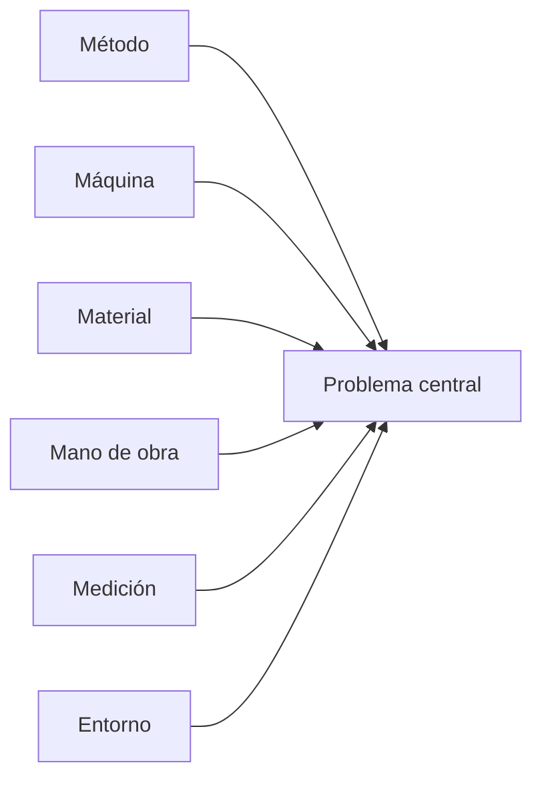

# Visuales obligatorios por bloque — Angélica

Los ejemplos buenos **no** se leen como ensayo: se ven como informe de
ingeniería (tablas + UML + pantallas). Preferir figura/tabla antes que
otro párrafo largo.

Benchmarks cuantitativos: [benchmarks-ejemplos.md](benchmarks-ejemplos.md).

## Densidad objetivo

| Tipo | Informe completo |
|------|------------------|
| Imágenes/diagramas | ≥ 25 (ideal 40–80) |
| Tablas | ≥ 20 (ideal 25–40) |
| Ritmo | ~1 visual cada 160–300 palabras |

Si al cerrar un capítulo solo hay prosa → incompleto.

## Mínimos por sección

| Bloque | Visual mínimo | Cómo |
|--------|---------------|------|
| Portada | Logo UAGRM o de la org. cliente | `insert_image` |
| Perfil · Org. | Organigrama | `insert_diagram` o imagen |
| Perfil · Problema | Tabla de problemas / áreas | `create_table` |
| Perfil · Alcance | Tabla de módulos / subsistemas | `create_table` |
| Elementos · HW | Tabla servidor \| cliente \| red \| otros | `create_table` |
| Elementos · SW | Tabla servidor \| cliente \| adicional | `create_table` |
| Costos | Ítem \| cant. \| unit. \| total | `create_table` |
| Beneficios | Dimensión \| antes \| después | `create_table` |
| Diseño de datos | ER / clases de dominio + tabla volúmenes | diagrama + tabla |
| Ishikawa | Causa-efecto | `insert_diagram` (Mermaid) |
| Ishikawa | Problema → causa → acción | `create_table` |
| Requisitos | Tabla de actores | `create_table` |
| Requisitos | Lista + priorización de CU | `create_table` |
| Requisitos | Diagrama de casos de uso | `insert_diagram` |
| Análisis | Paquetes / vista CU encapsulada | `insert_diagram` |
| Diseño | Clases, secuencia **o** comunicación | `insert_diagram` |
| Diseño | Actividad (flujos clave) | `insert_diagram` |
| Diseño | Despliegue **y/o** capas | `insert_diagram` |
| Implementación | 3–15 capturas de pantalla | `insert_image` (usuario) |
| Pruebas | Caso \| pasos \| esperado \| resultado | `create_table` |

## Catálogo UML visto en ejemplos buenos

Insertar (no solo nombrar) según el alcance del informe:

1. Casos de uso (actores + elipses)  
2. Clases (análisis y/o diseño)  
3. Secuencia **o** comunicación  
4. Actividad  
5. Paquetes  
6. Componentes (si aplica)  
7. Despliegue  
8. Capas / arquitectura  
9. Ishikawa  
10. Organigrama  

## Mermaid — Ishikawa (ejemplo)

Ajustar categorías al dominio. Insertar con `insert_diagram`.

## Pie de figura / tabla

Tras insertar, una línea en cursiva:

`Figura N. Descripción breve.`  
`Tabla N. Descripción breve.`

Referenciar en el párrafo anterior (“como se muestra en la Figura N…”).

## Imágenes

1. Preferir material del usuario (Drive / capturas del prototipo).  
2. Si no: `search_images` → `insert_image` con `insertUrl` exacta.  
3. Nunca URL inventada.  
4. Si Docs no carga: `rehostViaDrive=true`.  
5. En los buenos proyectos, las **pantallas del sistema** son gran parte del
   conteo de imágenes: pedirlas al usuario o generar mocks claros.

## Anti-patrón

Decir “a continuación el diagrama de clases” y dejar solo texto = fallo de DoD.
